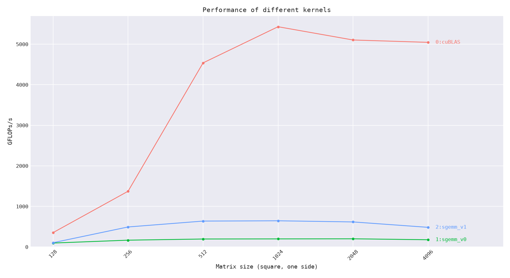
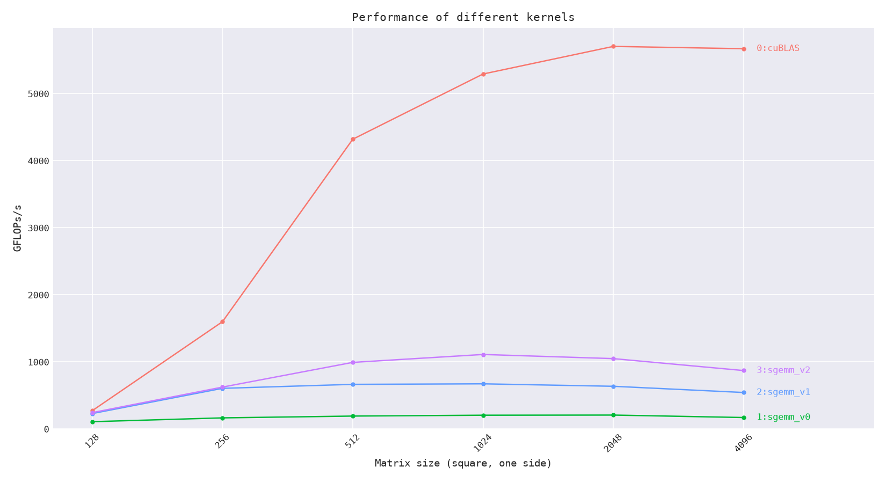

# GEMM（SGEMM）

单精度矩阵乘：`C(M×N) = A(M×K) × B(K×N)`，全部行主序。

## 状态

| 阶段 | 版本 | 实现要点 | 状态 |
| --- | --- | --- | --- |
| CUDA | v0 | 朴素实现（每线程一个输出元素，全局内存直访） | 完成（已接入测试） |
| CUDA | v1 | `sgemm_v1<32>` 全局内存访问合并尝试，每线程一个输出 | 完成（已接入测试） |
| CUDA | v2 | `sgemm_v2<32>` 共享内存分块：A / B 的 32×32 tile 进共享内存复用 | 完成（已接入测试） |
| 参考 | cuBLAS | `cublasSgemm`，`CUBLAS_PEDANTIC_MATH` 严格 FP32 对照 | 已接入测试 |
| Triton | t0 | 与 CUDA 同规格的 Triton 实现 | 规划中 |
| Triton | t1 | 与 CUDA 性能对照并记录 | 规划中 |

- 正确性判据：相对误差 ≤ 1e-3（累加顺序/粒度不同所致，见 `docs/benchmark-methodology.md`）。
- 指标：`TFLOPS = 2·M·N·K / 中位耗时`。

## 版本规划说明

- **v0 朴素**：建立正确性基线，速度不设预期。
- **v1 全局内存访问合并**：保留 `sgemm_v1<32>` 的原始模板实现；用 `BLOCKSIZE² = 1024` 个线性线程覆盖一个 `32×32` 输出 tile，不使用共享内存。启动约束为 `block=(1024,1)`、`grid=(ceil(M/32),ceil(N/32))`、动态共享内存 0 B —— 线程数不足 `BLOCKSIZE²` 时每 block 只写出 tile 首行（静默算错的坑，见「结论记录」）。
- **v2 共享内存分块**：`sgemm_v2<32>` 把 A / B 的 `32×32` tile 搬进共享内存，k 方向按 tile 步进，每线程仍算一个输出元素 —— 全局访存降到 v1 的 1/32。启动约束同 v1：`block=(1024,1)`、`grid=(ceil(M/32),ceil(N/32))`、动态共享内存 0 B（静态共享内存 8 KiB）。
- **v3（顺延）**：在共享内存分块基础上做 `float4` 装载与每线程多元素（寄存器分块）微调，追求寄存器级复用 —— 原 v2 规划。
- 后续（可选）：考虑仿射对齐 `A^T` 版本、split-K 或更细粒度优化，视学习节奏再定。

## 测试与参考规模

- 默认快速回归：仅 `512×512×512`。输出顺序固定为 cuBLAS 对照、v0、v1、v2；每项使用 1 次预热与 100 次计时迭代、CPU double 参考和 GPU 逐元素验证。v0 使用 `block=(16,16)`；v1 与 v2 均使用 `block=(1024,1)`，以 `BLOCKSIZE=32` 覆盖 `32×32` 输出 tile，动态共享内存为 0 B（v2 的共享内存为静态分配，8 KiB）。
- cuBLAS 对照：行主序输入按 `C^T=B^T×A^T` 映射给列主序 `cublasSgemm`，不额外转置或拷贝；固定 `CUBLAS_PEDANTIC_MATH`，作为严格 FP32 厂商库基准。
- 基准对比：`M=N=K=2048`（fp32），便于与朴素版对比且单轮耗时可控。
- 可选更大：`M=N=K=4096`。
- v1 的 `BLOCKSIZE` 为 32；物理 block 为 1024 个线性线程。
- 性能扫描（`--bench`）：对 `--sizes`（默认 `128,256,512,1024,2048,4096`）逐个正方形尺寸 **只计时、不做正确性校验**，结果写 CSV 供绘图脚本使用。采样为「1 次预热 + 自适应迭代」：先用 1 次调用估计单次耗时，再按 200 ms/点的预算决定每组迭代数（上限 100），连续采 3 组取中位数 —— 朴素 v0 在 4096³ 下单次约 0.95 s，固定 100 次迭代会让单点就耗掉数分钟。扫描模式的设备输入以 0 填充，不生成主机端输入、不做 CPU 参考与结果回拷。

## 目录布局

```
gemm/
├── README.md   # 本文档：规划 + 结论总表
├── src/        # CUDA 内核、CPU 参考、测试驱动与宿主入口
├── bench/      # --bench 扫描产出的 CSV 与性能曲线图（复现产物）
├── triton/     # Triton 版本（第二阶段）
└── notes/      # 学习笔记与工具用法（如 bench-usage.md）
```

## 性能可视化

一条命令采集数据、一条命令出图（两条都在仓库根目录执行）：

```bash
# 1. 多尺寸性能扫描 → operators/gemm/bench/<时间戳>/gemm_bench.csv（终端会打印实际路径）
./build/operators/gemm/gemm --bench
# 2. 画「GFLOP/s vs 矩阵尺寸」对比图 → PNG 与 CSV 同目录同名
python3 scripts/plot_kernel_perf.py --csv operators/gemm/bench/20260915145532/gemm_bench.csv
```

- 产物落点：每次 `--bench` 各占一个时间戳目录 `operators/gemm/bench/<YYYYmmddHHMMSS>/`，多次扫描互不覆盖；绘图脚本不传 `--out` 时把 PNG 写在 CSV 旁边。若把多个扫描的 CSV 一起传给绘图脚本（例如用通配符），脚本会因 `(label, size)` 重复直接报错。
- 扫描选项：`--sizes 128,256,512,1024,2048,4096`（默认）、`--csv <路径>`、`--warmup <次>`、`--budget <ms/点>`。`--bench` 退出码只在**所有**采样点都失败时为非 0：部分内核失败会打印 `SKIPPED` 并继续，扫描本身不作正确性判据（判据只在默认入口）。
- CSV 列：`label,size,median_ms,gflops,iters`（`label` 为内核短名，`gflops = 2·size³ / 中位耗时`）。`scripts/plot_kernel_perf.py` 只依赖这四列，其他算子给出同名列即可复用同一套绘图脚本。
- 图的样式（灰底白网格、等宽字体、等距分类刻度 + 45° 标签、线末端同色文字）对齐常见 CUDA 优化系列曲线图；配色、标题与坐标轴文字可用 `--palette` / `--title` / `--xlabel` / `--ylabel` 覆盖。
- `--bench` 的完整用法（参数表、终端输出样例、CSV 列、计时口径与常见坑）见 [`notes/bench-usage.md`](notes/bench-usage.md)。

## 结论记录

开发采样记录：RTX 4060 Laptop、CUDA 12.9、Release、sm_89；快速采样仅报告中位数，不能替代严格性能对比。

| 版本 | 形状 | 中位数 ms | TFLOPS | max_err | 备注 |
| --- | --- | --- | --- | --- | --- |
| v0 | 512×512×512 | 1.8651 | 0.144 | 1.275e-06 | 正确性通过；每线程一个输出元素，`block=(16,16)` |
| v1 | 512×512×512 | 0.3630 | 0.740 | 1.275e-06 | 正确性通过；每线程一个输出元素，`block=(1024,1)` 覆盖 `32×32` tile；相对 v0 快约 5.1× |
| v2 | 512×512×512 | 0.2660 | 1.009 | 1.275e-06 | 正确性通过；共享内存分块，`block=(1024,1)` 覆盖 `32×32` tile；相对 v1 快约 1.4×（同日复测 0.2609 ms） |
| cuBLAS | 512×512×512 | 0.0657 | 4.088 | 5.894e-07 | `CUBLAS_PEDANTIC_MATH`；严格 FP32 厂商库对照 |

上表为 2026-09-15 同一次运行的三项采样（1 次预热 + 100 次迭代单样本中位数）。同日三次运行的中位数波动：v1 0.3811 / 0.3630 / 0.3513 ms、v0 1.7935 / 1.8651 / 1.8344 ms、cuBLAS 0.0598 / 0.0657 / 0.0623 ms —— 快速采样仅供同场趋势参考，不能替代严格性能对比。

`sgemm_v1<32>` 的索引映射本身正确：2026-09-14 记录的 `max_err=1.000e+00`、错误元素数 253,952 来自物理 block 只起 32 个线程——每 block 只写出 `32×32` tile 的首行，于是 8192 项正确、253,952 项未写入（未写入区为 0 时相对误差恰为 1.000e+00），并非映射缺陷。按 `block=(1024,1)` 启动后，`512×512×512`、`513×511×509`、`32×32×32`、`33×1×1`、`1×1×1`、`1024×1024×1024` 均通过（`max_err ≤ 1.89e-06`）。

### 多尺寸性能曲线（2026-09-15 14:55:32 采样）



`--bench` 默认参数（`--sizes 128…4096`、1 次预热、200 ms/点预算、3 组中位数），同机同构建；单位 GFLOP/s（表与图、`bench/20260915145532/gemm_bench.csv` 同属一次扫描）：

| 版本 | 128 | 256 | 512 | 1024 | 2048 | 4096 |
| --- | --- | --- | --- | --- | --- | --- |
| cuBLAS | 352.5 | 1372.8 | 4538.0 | 5429.8 | 5102.8 | 5044.6 |
| v1 | 104.3 | 492.0 | 637.2 | 644.5 | 616.3 | 483.0 |
| v0 | 95.7 | 166.6 | 195.0 | 198.1 | 200.4 | 176.9 |

- 大尺寸点的每组迭代数被预算压到 1–3 次（cuBLAS 4096³ 为 3 次），样本量明显少于开发阶段口径，只用于看趋势。
- 同日多次扫描的波动不小：cuBLAS 512³ 在 `4538 ↔ 6329`、v1 4096³ 在 `439 ↔ 499` GFLOP/s 之间浮动 —— 小尺寸受 cuBLAS 内部算法选择与 GPU 时钟状态影响尤其明显，本表不构成严格性能结论（严格对比走 `docs/benchmark-methodology.md` 的 100 预热 / 21×1000 口径）。
- 观察：cuBLAS 在 512³ 之后进入平台期（5.0–5.4 TFLOP/s）；v1 约为 cuBLAS 的 1/10（512³ 约 14.0%、4096³ 约 9.6%），且 2048³ 起随尺寸增大而下降，符合「无数据复用、受全局内存带宽限制」的预期；v0 每输出元素要读 K 次 A 与 K 次 B，稳定在 167–200 GFLOP/s。

### 多尺寸性能曲线（2026-09-15 19:24:08 采样，含 v2）



`--bench` 默认参数、`--sizes 128…4096`，同机同构建，单位 GFLOP/s（图与 `bench/20260915192408/gemm_bench.csv` 同属一次扫描）：

| 版本 | 128 | 256 | 512 | 1024 | 2048 | 4096 |
| --- | --- | --- | --- | --- | --- | --- |
| cuBLAS | 272.3 | 1600.0 | 4320.1 | 5292.5 | 5704.1 | 5669.7 |
| v2 | 244.1 | 625.0 | 993.2 | 1111.2 | 1049.4 | 871.6 |
| v1 | 230.1 | 606.3 | 665.8 | 673.6 | 636.9 | 544.4 |
| v0 | 109.1 | 166.1 | 192.8 | 205.8 | 207.8 | 171.1 |

- v2 相对 v1：512³ 1.49×、1024³ 1.65×、2048³ 1.65×、4096³ 1.60× —— 共享内存分块把全局访存降到约 1/32，收益随尺寸上升而显现，4096³ 回落说明仅靠 tile 复用仍受共享内存带宽与占用率限制。
- v2 仍约为 cuBLAS 的 1/5（512³ 23.0%、4096³ 15.4%）：cuBLAS 另有寄存器分块、`float4` 装载与更大的 tile（如 128×128）等优化，即 v3 及后续的方向。
- 样本量同上节：大尺寸点每组迭代数被 200 ms 预算压到 1–4 次，只用于看趋势，不构成严格性能结论。
